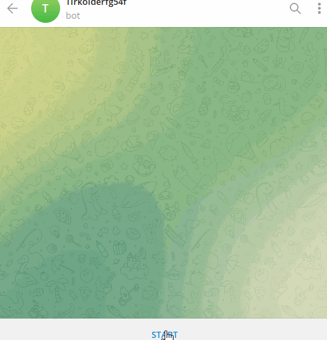

# Telegram Bot Convert Image to Base64 and Webp 
___
Tested Python 3.7
___
**Instructions for using the Telegram bot Convert Image to Base64 and Webp:**

- Create a bot on [BotFather](https://t.me/BotFather "BotFather") and obtain the **API** token to insert into the program code **YOUR_TOKEN_HERE**.

- Install the required libraries using the command 
```python
pip install -r requirements.txt
```



